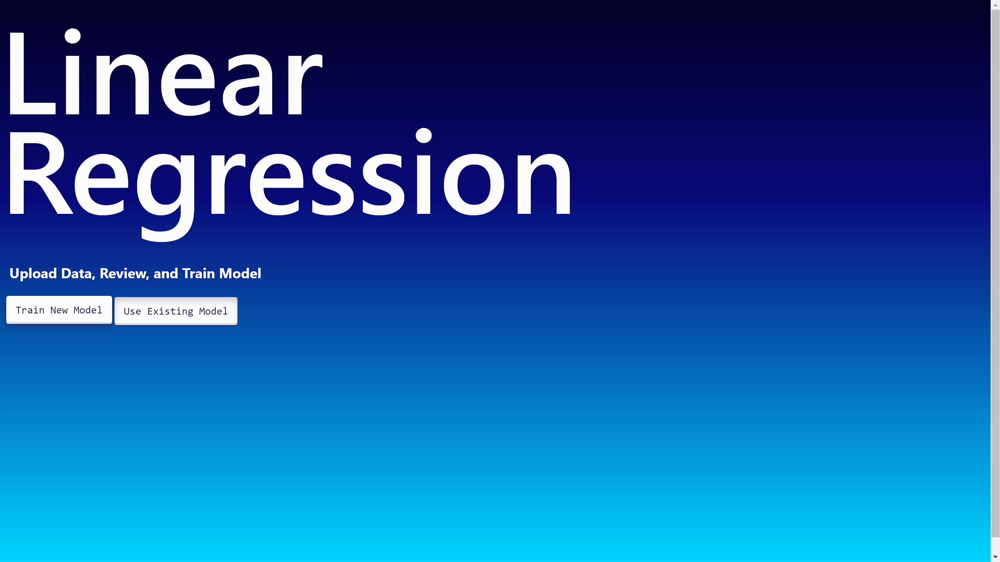
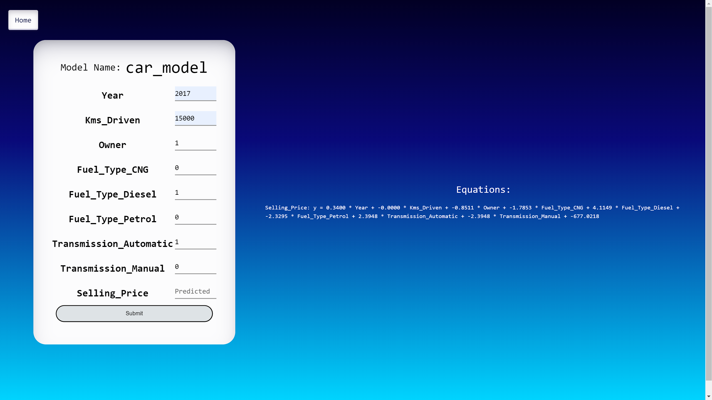

# Linear Regression Model Training Web App

## Description

This project allows users to train Linear Regression models through a web interface using Django and Pandas. Users can specify their own datasets, select data and prediction columns, and train their models. The trained models can then be used for making predictions.

## Features

- **Data Upload and Review:**
    - Users can upload CSV files containing their datasets.
    - Uploaded data is displayed for review, and users can select columns for training.

- **Model Training:**
    - Users can train Linear Regression models by selecting data and prediction columns.
    - Trained models are stored in MongoDB for future use.

- **Model Prediction:**
    - Users can input data and use the trained models to make predictions.
    - Equations for the trained models are displayed.

## Technologies Used

- Django
- Pandas
- MongoDB
- Scikit-learn

## How to Use

1. Clone the repository:

     ```bash
     git clone https://github.com/Shreypatel65/PY-Model-Training
## Features

- **Data Upload and Review:**
  - Users can upload CSV files containing their datasets.
  - Uploaded data is displayed for review, and users can select columns for training.

- **Model Training:**
  - Users can train Linear Regression models by selecting data and prediction columns.
  - Trained models are stored in MongoDB for future use.

- **Model Prediction:**
  - Users can input data and use the trained models to make predictions.
  - Equations for the trained models are displayed.

## Technologies Used

- Django
- Pandas
- MongoDB
- Scikit-learn

## How to Use

1. Clone the repository:

   ```bash
   git clone https://github.com/your-username/linear-regression-web-app.git
2. Install dependencies:

    ```bash
    pip install -r requirements.txt
3. Set up MongoDB:
    - Make sure MongoDB is installed and running.
    - Update the MongoDB connection details in views.py.

4. Run the Django development server:
    ```bash
    python manage.py runserver
5. Open your browser and go to http://127.0.0.1:8000/ to use the web app.

## Folder Structure

- **model:** Django app containing views, templates, and static files.
- **templates:** HTML templates for rendering views.
- **static:** CSS files for styling.

## Sceenshots






## Additional Notes
- Make sure to handle security considerations before deploying to a production environment.
- Customize the CSS files in the static folder for better styling.
## Contributor
- Shrey Patel

Feel free to modify this template according to your project structure and specific details. Ensure that you update the information such as MongoDB connection details, repository link, and contributor details before publishing on GitHub.